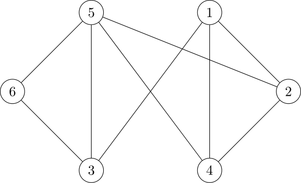
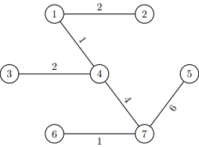

## Θέμα 1
### Μπορούμε αν διακρίνουμε τις εξής τάξεις πολυπλοκότητας:
#### Σταθερή
β. $2^5$

#### Γραμμική
δ. $3n + 100logn$ με επικρατέστερη πολυπλοκότητα να είναι η $3n$

ε. $5n$

#### Πολυωνυμική
α. $4nlogn + 2n$ με επικρατέστερη πολυπλοκότητα να είναι η $nlogn$

γ. $2^{3logn}$ επειδή $2^{3logn} \Leftrightarrow 2^{logn^3} \Leftrightarrow n^3$

η. $n^2 + 10n$

θ. $n^5$

ι. $nlogn$

#### Εκθετική

ζ. $2^n$

Γνωρίζουμε γενικά πώς:
Σταθερή $\lt$ Γραμμική $\lt$ Πολυωνυμική ($nlogn$) $\lt$  Πολυωνυμική ($n^i$)

Οπότε η σειρά πάει ως εξής:

$2^5 \leq 3n + 100logn \leq 5n \leq nlogn \leq 4nlogn + 2n \leq n^2 + 10n \leq 2^{3logn} \leq n^5 \leq 2^n\ \ \Leftrightarrow\ \ $ β $\leq$ δ $\leq$ ε $\leq$ ι $\leq$ α $\leq$ η $\leq$ γ $\leq$ θ $\leq$ ζ

Οπότε, η σωστή απάντηση είναι το **Δ**

## Θέμα 2

Ξεκινώντας από το 1, ο αλγόριθμος θα επισκεφτεί πρώτα το 2, στη συνέχεια το 3 (γιατί είναι ο πρώτος γείτονας του 2 που δεν έχουμε επισκεφθεί ακόμα), μετά το 4 (ίδια λογική με την προηγούμενη). Από το 4 δε μπορούμε να πάμε κάπου που δεν έχουμε ήδη επισκευθεί, οπότε γυρνάμε στους γείτονες του 3. Από εκεί, πάμε στο 5 και τελικά απο το 5 καταλήγουμε στο 6.

Οπότε, άμα στο $G$ κάνουμε αναζήτηση πρώτα κάτα βάθος (Deapth-First Search), η σειρά επίσκεψεις των κορυφών θα είναι ως εξής:

1 $\rightarrow$ 2 $\rightarrow$ 3 $\rightarrow$ 4 $\rightarrow$ 5 $\rightarrow$ 6

Οπότε, η σωστή απάντηση είναι το **Β**

## Θέμα 3

Ξεκινώντας από το **1**, ο αλγόριθμος βάζει στην ουρά τις κορυφές 2, 4 και 5. Στη συνέχεια, επισκέφτεται την κορυφή **2**, όπου βάζει στην ουρά τις κορυφές 1, 3 και 4. Συνεχίζει στο **4**, όπου βάζει τις κορυφές 1,2 και 3. Η επόμενη κορυφή στην ουρά είναι η **5**, όπου μπαίνουν στην ουρά οι κορυφές 1, 3 και 6. Η επόμενη που δεν έχει επισκεφθεί είναι η **3**, όπου μπαίνουν στην ουρά οι 2, 4, 5, 6 .Οι επόμενες κορυφές που βρίσκονται στην ουρά δεν επισκέπτονται, αφού έχουν επεξεργαστεί ήδη. Η τελευταία κορυφή που επισκέπτεται ο αλγόριθμος είναι η **6** και εκεί τερματίζει.

Οπότε, άμα στο $G$ κάνουμε αναζήτηση πρώτα κάτα πλάτος (Breadth-First Search), η σειρά επίσκεψεις των κορυφών θα είναι ως εξής:

1 $\rightarrow$ 2 $\rightarrow$ 4 $\rightarrow$ 5 $\rightarrow$ 3 $\rightarrow$ 6

Οπότε, η σωστή απάντηση είναι η **Δ**

## Θέμα 4

α. **Αληθείς** $\rightarrow$ από το 1 μπορείς να πας στο 4, από το 4 στο 3, από το 3 στο 5 και από το 5 στο 6.

β. **Ψευδείς** $\rightarrow$ υπάρχουν συνδέσεις μεταξύ διαδοχικών κορυφών. **Προσοχή**: η ακολουθία **δεν είναι *απλό* μονοπάτι** επειδή υπάρχουν επαναλήψεις κορυφών.

γ. **Ψευδείς** $\rightarrow$ παρόλο που υπάρχουν κύκλοι μέσα στην ακολουθία (4 $\rightarrow$ 3 $\rightarrow$ 2 $\rightarrow$ 4 και 3 $\rightarrow$ 2 $\rightarrow$ 4 $\rightarrow$ 3), η ακολουθία ολόκληρη **δεν είναι κύκλος** επειδή η αρχική και η τελική κορυφή δεν είναι ίδιες.

δ. **Αληθείς** $\rightarrow$ υπάρχει μονοπάτι μεταξύ αυτών των κορυφών **και** η αρχική με την τελική κορυφή είναι ίδιες.

ε. **Αληθείς** $\rightarrow$ υπάρχει μονοπάτι μεταξύ αυτών των κορυφών **και** δεν επαναλαμβάνεται καμία κορυφή.

ζ. **Αληθείς** $\rightarrow$ υπάρχει μονοπάτι μεταξύ αυτών των κορυφών **και** περνάμε από 4 ακμές συνολικά

η. **Ψευδής** $\rightarrow$ παρόλο που υπάρχει μονοπάτι μεταξύ αυτών των κορυφών, περνάμε από **4** ακμές και **όχι 5**

θ. **Ψευδής** $\rightarrow$ ο βαθμός μιας κορυφής ορίζεται ως ο αριθμός των ακμών της (δηλαδή ο αριθμός των κορυφών με τις οποίες συνδέεται). Η κορυφή 4 έχει 3 ακμές:
    - μία που την συνδέει με την κορυφή 1
    - μία που την συνδέει με την κορυφή 2
    - μία που την συνδέει με την κορυφή 3

Η αληθείς προτάσεις είναι οι α, δ, ε, ζ, άρα η σωστή απάντηση είναι η **Ε**.

## Θέμα 5
α. **Είναι** $\rightarrow$
- το 2 ακολουθεί το 1
- το 5 ακολουθεί το 2
- το 4 ακολουθεί το 1 **ΚΑΙ** το 2
- το 7 ακολουθεί το 4 **ΚΑΙ** το 5
- το 3 ακολουθεί το 1 **ΚΑΙ** το 4
- το 6 ακολουθεί το 3 **ΚΑΙ** το 7

β. **ΔΕΝ είναι** $\rightarrow$
- το 3 πρέπει να ακολουθεί το 4 και το 1, αλλά στη συγκεκριμένη ακολουθία, είναι πρώτα το 3 και μετά το 4

γ. **ΔΕΝ είναι** $\rightarrow$
- ακριβώς ίδιος λόγος με το **β**

δ. **ΔΕΝ είναι** $\rightarrow$
- το 7 πρέπει να ακολουθεί **ΚΑΙ** το 4 **ΚΑΙ** το 5, αλλά ακολουθεί μόνο το 4

ε. **Είναι** $\rightarrow$
- το 2 ακολουθεί το 1
- το 4 ακολουθεί το 1 **ΚΑΙ** το 2
- το 3 ακολουθεί το 1 **ΚΑΙ** το 4
- το 5 ακολουθεί το 2
- το 7 ακολουθεί το 4 **ΚΑΙ** το 5
- το 6 ακολουθεί το 3 **ΚΑΙ** το 7 

Δηλαδή, από όλες τις ακολουθίες, αυτές που είναι τοπολογικές διατάξεις του $G$ είναι οι α και ε. Οπότε η σωστή απάντηση είναι η **Ε**

## Θέμα 6
Μπορούμε να εφαρμόσουμε τον αλγόριθμο του Kruskal για να βρούμε το ελάχιστο επικαλύπτον δένδρο (minimum spanning tree) του $G$

1) Αρχικά, ταξινομούμε όλες τις ακμές ((αρχική κορυφή - τελική κορυφή), βάρος) σε αύξουσα σειρά, βάσει του βάρους τους.
    (1 - 2), 2                               (1 - 4), 1
    (1 - 3), 4                               (6 - 7), 1
    (1 - 4), 1                               (1 - 2), 2
    (2 - 4), 3                               (3 - 4), 2
    (2 - 5), 10                              (2 - 4), 3
    (3 - 4), 2         $\Rightarrow$         (1 - 3), 4      
    (3 - 6), 5                               (4 - 7), 4
    (4 - 5), 7                               (3 - 6), 5
    (4 - 6), 8                               (5 - 7), 6
    (4 - 7), 4                               (4 - 5), 7
    (5 - 7), 6                               (4 - 6), 8
    (6 - 7), 1                               (2 - 5), 10

2) Παίρνουμε τις ακμές μία-μία και τις προσθέτουμε στο δένδρο, ελέγχοντας πρώτα αν δημιουργούν κάποιο κύκλο στο δένδρο:
    - (1 - 4), 1: μπαίνει
    - (6 - 7), 1: μπαίνει
    - (1 - 2), 2: μπαίνει
    - (3 - 4), 2: μπαίνει 
    - (2 - 4), 3: **δε** μπαίνει γιατί δημιουργείται κύκλος/δε προσθέτει κάποια νέα πληροφορία
    - (1 - 3), 4: **δε** μπαίνει γιατί δημιουργείται κύκλος/δε προσθέτει κάποια νέα πληροφορία
    - (4 - 7), 4: μπαίνει
    - (3 - 6), 5: **δε** μπαίνει γιατί δημιουργείται κύκλος/δε προσθέτει κάποια νέα πληροφορία
    - (5 - 7), 6: μπαίνει

    Θα μπορούσαμε να συνεχίσουμε να εξετάζουμε και τις υπόλοιπες ακμές, όμως καμία άλλη δε θα προσθεθεί, καθώς έχουμε ήδη 6 ακμές σε ένα δένδρο με 7 κορυφές (τα δένδρα έχουν $n-1$ ακμές)

    Το τελικό MST:

    

Οπότε η σωστή απάντηση είναι **Ε**

## Θέμα 7
- *Το δένδρο είναι AVL*  $\rightarrow$  **Λάθος** (παραβιάζεται στο 15)
- *Το δένδρο δεν είναι AVL*  $\rightarrow$  **Σωστό** (παραβιάζεται στο 15)
- *Ο κόμβοες με κλειδί 15 δεν έχει την ιδιότητα AVL*  $\rightarrow$  **Σωστό** (παραβιάζεται στο 15)
- *O κόμβος με κλειδί 14 είναι αριστερά υψηλότερος (left-higher, /)*  $\rightarrow$  **Σωστό** αφού έχει μόνο αριστερό παιδί.

Οπότε, σωστή απάντηση είναι **Β**, **Γ** και **Δ**

## Θέμα 8
Η σωστή απάντηση είναι **Γ**

## Θέμα 9
49 % 7 = 0 $\rightarrow$ μπαίνει στη θέση 0

27 % 7 = 6 $\rightarrow$ μπαίνει στη θέση 6

141 % 7 = 1 $\rightarrow$ μπαίνει στη θέση 1

45 % 7 = 3 $\rightarrow$ μπαίνει στη θέση 3

72 % 7 = 2 $\rightarrow$ μπαίνει στη θέση 2

24 % 7 = 3 $\rightarrow$
    - υπάρχει ήδη στοιχείο εκεί, οπότε ελέγχουμε τη θέση 0
    - στο 0 υπάρχει στοιχείο, οπότε ελέγχουμε τη θέση 6
    - στο 6 υπάρχει στοιχείο, οπότε ελέγχουμε τη θέση 5
    - στο 5 δεν υπάρχει στοιχείο, οπότε το κλειδί 24 μπαίνει εκεί.

Οπότε, σωστή απάντηση είναι **Γ**

## Θέμα 10
1) **ΔΕΝ ΕΙΝΑΙ** $\rightarrow$ το 16 και 9 είναι παιδιά του 15, άρα δεν είναι ούτε min-heap ούτε max-heap. όλοι οι απόγωνοι ενός κόμβου πρέπει να είναι ή μικρότεροι ή μεγαλύτεροι, αλλά δε γίνεται και τα 2 μαζί.

2) **ΕΙΝΑΙ** $\rightarrow$ max-heap κι όλας!

3) **ΔΕΝ ΕΙΝΑΙ** $\rightarrow$ επειδή δεν είναι complete (στο τελευτάιο επίπεδο πρέπει να είναι όσο πιο αριστερά)

4) **ΕΙΝΑΙ** $\rightarrow$ max-heap πάλι. Στο τελευταίο επίπεδο είναι όσο πιο αριστερά οι κόμβοι.

Οπότε σωροί είναι οι **2** και **4**, οπότε η σωστή απάντηση είναι **Δ**

## Θέμα 11
1) **Λάθος** $\rightarrow$ ένα υποδένδρο με ρίζα έναν κόκκινο κόμβο δεν είναι δένδρο κόκκινο-μαύρο, γιατί παραβιάζει το κριτήριο ρίζας (η ρίζα ενός κόκκινου-μαύρου δένδρου είναι μαύρη).
2) **Σωστό**
3) **Σωστό**
4) **Λάθος**

Άρα η σωστή απάντηση είναι **Γ**

## Θέμα 12
Η σωστή απάντηση είναι **Γ**

## Θέμα 13
Η σωστή απάντηση είναι **Α** και **Β**

## Θέμα 14
Η σωστή απάντηση είναι **Ε: κανένα από τα παρπάνω**