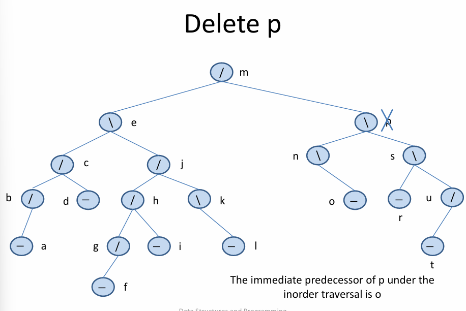

# Introduction
This file contains a "prettier" and more summarized version of the slides provided for the course "Data Structures and Programming Techniques-K08(Even)" course from the DIT at NKUA

## Contents

[🔗 Linked Data Representations](#-linked-data-representations)

[🔁 Recursion](#-recursion)

## 🔗 Linked Data Representations

#### Key Concepts:
- **Linked Structures**: Lists, stacks, queues, sets, and trees are dynamic and flexible, ideal when data sizes or shapes are unpredictable.

- **Pointers in C**: Core for implementing linked structures.

    - `*` dereferences a pointer.

    - `&` gives the address.

    - `malloc()` allocates memory dynamically.

    - `free()` deallocates memory, cautioning against dangling pointers.

#### Linked Lists:

- **Structure**:
    ```c
    typedef struct NodeTag {
        AirportCode Airport;
        struct NodeTag * Link;
    } NodeType;
    ```

- **Operations**:
    - Insert/delete nodes (e.g., insert in second position or at the end).

    - Traverse/search via `ListSearch`.

    - Print list using pointer traversal.

    - **Visual diagrams** help illustrate node connections and effects of operations.

#### Function Examples:
- swapping with pointers:
    ```c
    void Swap(int * p, int * q) {
        int temp = *p;
        *p = *q;
        *q = temp;
    }
    ```

- insert new node:
    ```c
    N->Link = L->Link;
    L->Link = N;
    ```

- delete last node:
    Requires `NodeType ** L` to modify the head if necessary.

## 🔁 Recursion

#### Introduction:

- Recursion solves problems by breaking them into smaller subproblems.

- Needs:

    - A **base case** to stop recursion.
    - Recursive step(s) to reduce problem size.

#### Examples:

- **Sum of squares (m to n)**:

    - Going up: `return m*m + SumSquares(m+1, n)`;

    - Going down: `return SumSquares(m, n-1) + n*n`;

    - Divide & conquer: splits range into two halves.

- **Factorial**:
    ```c
    int Factorial(int n) {
        return (n == 1) ? 1 : n * Factorial(n - 1);
    }
    ```

- **Reversing a Linked List**:

    - **Iteratively**: uses pointers R (reversed), N (current), L1 (traverse).

    - **Recursively**: splits list into head/tail, reverses tail, then concatenates.

Advanced Example:

- **Towers of Hanoi**: classic recursion puzzle.

    - Moves are computed recursively: `2^n - 1` steps.

    - Recursive function `MoveTowers` calls itself three times.

## 🧩 Modularity and Data Abstraction

#### **Principles**:

- **Procedural Abstraction**: Hide implementation details; focus on what, not how.

- **Information Hiding**: Use local variables and modular design to prevent conflicts and simplify changes.

#### Modules:
- In **C**, simulated using `.h` and `.c` files:
    - `.h`: defines interface (function prototypes, types).
    - `.c`: contains private/internal details and full function implementations.

- **Encapsulation**: Bundling data and methods, common in OOP languages (e.g., Python modules, Java classes).

#### Priority Queue (ADT) Example:
- Operations: initialize, check empty/full, insert, remove highest priority.

- **Implementations**:
    - **Sorted Linked List**:
        - `Insert` uses `SortedInsert` to maintain order.
        - `Remove` return and deletes head (highest priority).
    - **Unsorted Array**:
        - `Insert` appends.
        - `Remove` searches for and removes the max element.

#### Complex Number ADT:
- Abstract interface hides internal structure.
- **Interface (COMPLEX.h)**:
    ```c
    typedef struct complex *Complex;
    Complex COMPLEXinit(float, float);
    float Re(Complex);
    float Im(Complex);
    Complex COMPLEXmult(Complex, Complex);
    ```
- **Implementation**:
    Uses dynamic memory, returns opaque handles.


## 📚 Stacks (LIFO - Last In, First Out)

**Real-world analogies: Plates stack, browser backtracking, function calls.**

#### Stack ADT Operations:
1) `InitializeStack(S)`
2) `Empty(S)`
3) `Full(S)`
4) `Push(item, S)`
5) `Pop(S, &item)`

#### Applications:
- **Balanced Parentheses Checker**:
    - Push opening brackets.
    - Pop and match for closing brackets.

- **Postfix Expression Evaluation**: 
    - Push operands.
    - On operator, pop two operands, apply operation, push result.

    ```c
    // Pseudocode
    if (token is number) push(token)
    if (token is operator) {
        right = pop(); left = pop();
        push(left op right);
    }

    ```

- **Implementations**:
    - **Array-based**:
        - Fixed size.
        - `Count` tracks top index.

    - **Linked List-based**:
        - Dynamically growing.
        - Each node points to previous.

## 🔁 Queues (FIFO - First In, First Out)
**Real-world analogies**: Printer queues, customer service lines.

#### Queue ADT Operations:

1) `InitializeQueue(Q)`
2) `Empty(Q)`
3) `Full(Q)`
4) `Insert(item, Q)` – at *rear*
5) `Remove(Q, &item)` – from *front*

#### Implementations:
- **Sequential (Array)**:
    - Can be inefficient due to wasted space at front.
    - Improved via **Circular Queue**:
        - Uses modulo arithmetic to wrap around.

    ```c
    Rear = (Rear + 1) % N;
    Front = (Front + 1) % N;
    ```

- **Linked List**:
    - Nodes with `Item` and `Link`.
    - Efficient, unbound size.

#### Advanced Abstraction:
- Hide implementation details via `QPointer` and interface functions like `QUEUEput`, `QUEUEget`, etc.

## 🧠 Summary Table

|Concept  | Stack   | Queue |
|---------|---------|-------|
|Policy | LIFO | FIFO |
|Use Cases|	Parsing, recursion, undo | Job scheduling, simulations |
|Key Ops | Push, Pop | Insert, Remove |
|Implementations | Array, Linked List | Circular Array, Linked List|

## 🔍 Introduction to the Analysis of Algorithms
**Goal**: Understand how to evaluate algorithm performance independently of hardware or language differences.

#### Key Concepts:
- **Why Analyze?**
    - Same algorithm can perform differently on different systems.
    - Focus instead on *growth* of resource usage (time, space) as input size increases.

- **Big-O Notation** (`O-notation`):
    - Measures worst-case time complexity.
    - Only the **dominant term** matters; constants are ignored.
    - Examples:
        - $O(1)$ – Constant

        - $O(logn)$ – Logarithmic

        - $O(n)$ – Linear

        - $O(nlogn)$ – Log-linear

        - $O(n^2)$ – Quadratic

        - $O(2^n)$ – Exponential

- **Example: Selection Sort**
    - Time Complexity: $O(n^2)$
    - Real-world performance varies by hardware, but the *shape* of the curve stays quadratic.

- **Case Types**:
    - *Best Case*: Minimum time
    - *Worst Case*: Maximum time (usually analyzed)
    - *Average Case*: Expected time under uniform distribution

- **Formal Definition**:
    - $f(n) = O(g(n))$ if $\exists$ constants $K$ and $n_0$ such that $f(n) \leq Kg(n)$ $\forall$ $n \geq n_0$

    - Example:
        
        - $f(n) = logn$ (red)
        - $g(n) = 2^{n}\ -\ 6$ (blue)

        

        When $n \rightarrow \infty$, $g(n)$ will always be greater than $f(n) = 2^{x}\ -\ 6$

## Linked Lists (Revesited)

#### **Representations of Lists**

- **Sequential (Array-based):**
    - Fast $O(1)$ access.
    - Costly $O(n)$ insertions/deletions; fixed size risks overflow or waste.

- **Linked (Pointer-based):**
    - Uses nodes linked by pointers.
    - More flexible for insertions/deletions, but $O(n)$ access time.

#### **One-Way Linked Lists**
- Nodes point only forward
- Example data types
    ```c
    typedef struct NodeTag {
        AirportCode Airport;
        struct NodeTag * Link;
    } NodeType;
    typedef NodeType * NodePointer;
    ```
#### Accessing the ith Item
- Traverse nodes using `Link` until reaching the ith item.

- Worst-case time: $O(n)$; average also $O(n)$.


## AVL Trees
#### **What is an AVL Tree?**
- **AVL Tree** is a type of self-balancing binary search tree.
- Named after inventors Adelson-Velsky and Landis.
- For every node, the heights of the left and right subtrees differ by at most 1.

- **Balance Factor**
    - Balance Factor = Height(left subtree) - Height(right subtree)
    - Must be -1, 0, or +1 for all nodes.

- **Properties**:
    - The height of an AVL tree storing $n$ keys is $O(logn)$, meaning that the tree keeps its height small

#### Examples:


- **Notations**

    |Notation | Meaning |
    |---------|---------|
    |/ | left-higher node |
    |\ | right-higher node |
    |\- | equal balance factor |
    |// | isn't AVL and the left path is longer |
    |\\\ | isn't AVL and the right path is longer |

- Examples: 


#### **Insertion**
- If a node N is “-” and we insert a new node in its left or right subtree then the AVL tree property at node N is not lost and N becomes “/” or “\” respectively.
- If a node Ν is “/” and we insert a node in its right subtree (i.e., its shorter subtree) then the AVL tree property at node N is not lost and N becomes “-”.
-  If a node Ν is “\” and we insert a node in its left subtree (i.e., its shorter subtree) then the AVL tree property at node N is not lost and N becomes “-”.

These isertions preserve the AVL tree property and doesn't require any rotations to rebalnce it.

To maintain balance after insertions, AVL trees use rotations:
1) **Right Rotation (LL Rotation)**

    
2) **Left Rotation (RR Rotation)**

    
3) **Left-Right Rotation (LR Rotation)**
    
    
4) **Right-Left Rotation (RL Rotation)**

    

#### **Deletion**:
Uses similar logic to insertion.

1) Suppose node *x* has two children. We can find the **immediate predecessor** *y* of *x* **under the inorder traversal** : take the left child of *x* and then move right as far as possible. *y* **won't have any right children**.

2) **We place *y* into the position in the tree occupied by *x***. Then, we delete *y* from its former position by proceeding as  follows.
    - Delete node *y* from the tree.
    - Since we know that *y* has at most one child, **we delete *y* by simply linking the parent of *y* to the single child of *y* (or to NULL, if there is no child)**.
    - The height of the subtree formerly rooted at *y* has been reduced by 1, so **we must trace the effects of this change on height through all the nodes on the path from the parent of *y* back to the root of the tree**.

- Example:





- Tracing the effects of the Deletions
    - trace the effects of the change on height from the parent of *y* to the root of the tree
    - we can use a **Boolean variable `shorter` to show if the height of a subtree has been shortened**.
    - the Boolean variable `shorter` is initially `TRUE`.
    - **for each node *p* on the path from the parent of *y* to the root of the tree**, if `shorter` remains `TRUE`, while, the algorithm terminates if `shorter` becomes `FALSE`.
        - **Case 1: No Rotation**

            The current node *p* has balance factor equal. The **balance factor changes** depending on **which subtree has been shortened** and `shorter` becomes `FALSE`.

            

        - **Case 2: No rotation**

            The balance factor of *p* is not equal, and the taller subtree was shortened. We will change the balance factor of *p* to equal and leave `shorter` as `TRUE` because the height of tree rooted at *p* has changed.

            

        - **Case 3**

            The balance factor of *p* is not equal and the shorter subtree was shortened. **The height requirement for an AVL tree is now violated at p**, so we apply a rotation as follows to restore balance.

             Let *q* be the root of the taller subtree of *p* (the one not shortened). We **have three cases according to the balance factor of *q***.

            - **Case 3a: Single left rotation**

                **The balance factor of *q* is equal**. A single left rotation at *p* (with changes to the balance factors of *p* and *q*) restores balance, and `shorter` becomes `FALSE`.

                

            - **Case3b: Single left rotation**

                **The balance factor of *q* is the same as that of *p*.** We will apply a single left rotation at *p*, set the balance factor of *p* and *q* to equal, and leave `shorter` as `TRUE`

                

            - **Case 3c: Double right-left rotation**

                **The balance factors of *p* and *q* are opposite.** We will apply a double right-left rotation at *q* and *p*, set the balance factor of the new root to equal and the other balance factors as appropriate, and leave `shorter` as `TRUE`. 

                

            - **Symmetric Cases**

                In the cases above, we only shoes only one cases of the "not equal" balance factor of node *p* ("\"). The other case ("/") is symmetric.

- Applying the Deletion Algorithm to the previous **example**

    

    

    

    

1) trace the effects of this change on height through all the nodes on the path form *n* (parent of *o*) to the root of the tree.
2) we will use the bool variable `shorter` to show if th eheight of a subtree has been shortened. The boolean variable `shorter` is initially `TRUE`.
3) the balance factor of the node *n* is not equal (it is "\") and the taller subtree was shortened.* We have Case 2 of the algorithm where no rotation is required.* We will change the balance factor of *n* to equal and leave `shorter` as `TRUE` because the height of tree rooted at *n* has changed. 

    

4) we move to node *o* and examine its balance factor: "\\\\" and the shorter subtree was shortened. We will apply rotation to restore balance.
5) the root of the taller subtree of *o* (the one not shortened) is *s* and with balance factor of "\\" (same as *o*). Therefore, we have case **3b of the algorithm**.  We will apply a single left rotation at *o*, set the balance factors of *o* and *s* to equal, and leave `shorter` as `TRUE`.

    

    

6) at node *m* the balance factor is "//" and the shorter subtree was shortened. We will apply rotation to restore the balance.
7) the root of the taller subtree is *e* with balance factor "\" (opposite to m). That is case 3c of the algorithm.
8) we will apply a **double left-right rotation** at *e* and *m*, set the balance factors of the new root *j* to equal and the balance factors of *e* and *m* as appropriate, and leave `shorter` as `TRUE`.

Since we have reached the root of the tree, the algorithm terminates.


The algorithm can be implemented both iteratively and recursively

#### **Searching**
Since an AVL tree is a binary search tree, the search algorithm remains the same.

#### **Complexities**

|Operation | Complexity|
|----------|-----------|
| search | $O(logn)$ |
| insertion | $O(logn)$ |
| deletion | $O(logn)$ |