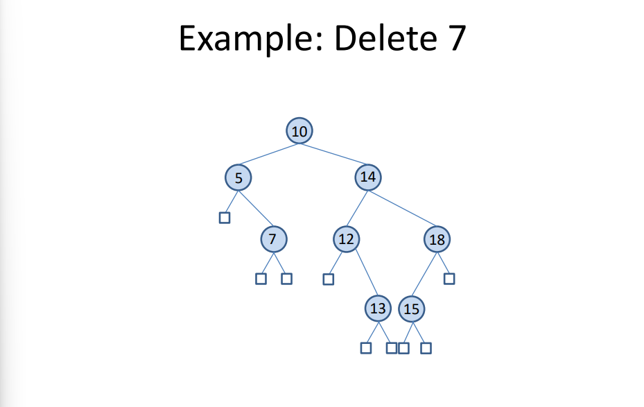
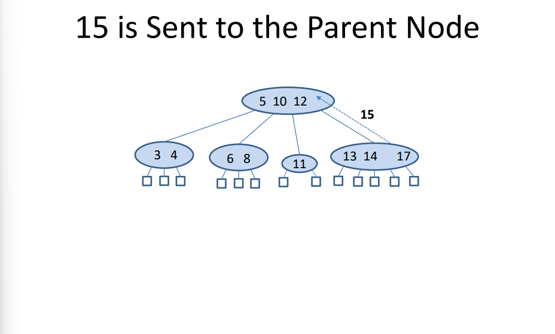
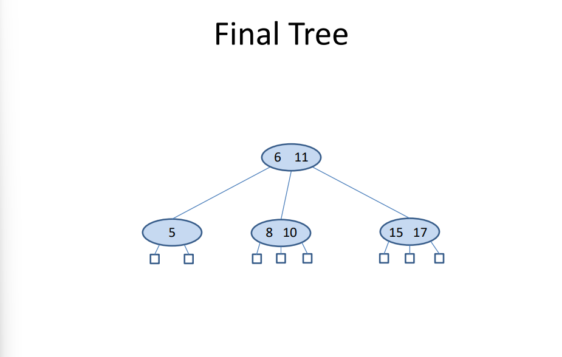
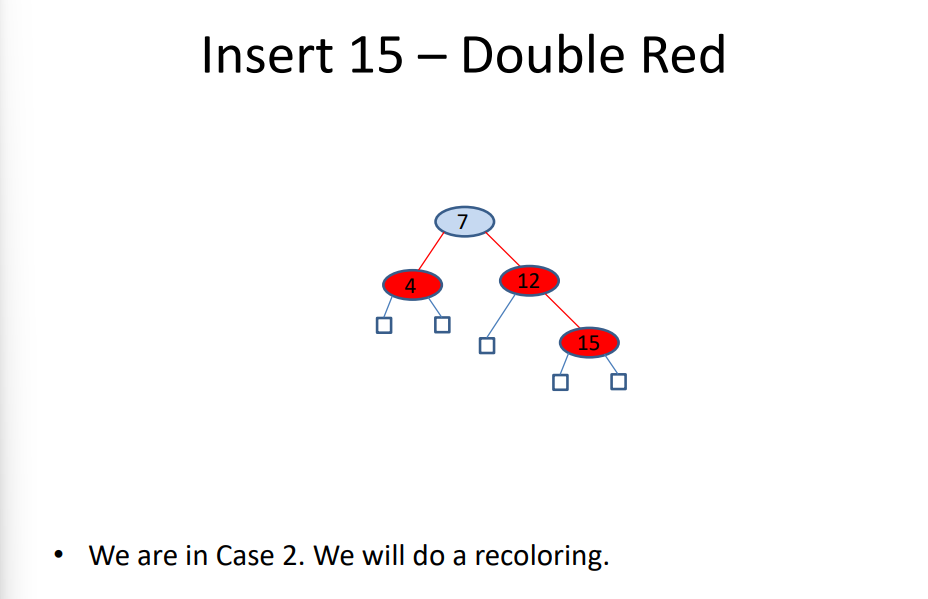
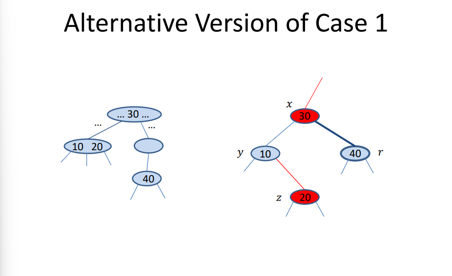
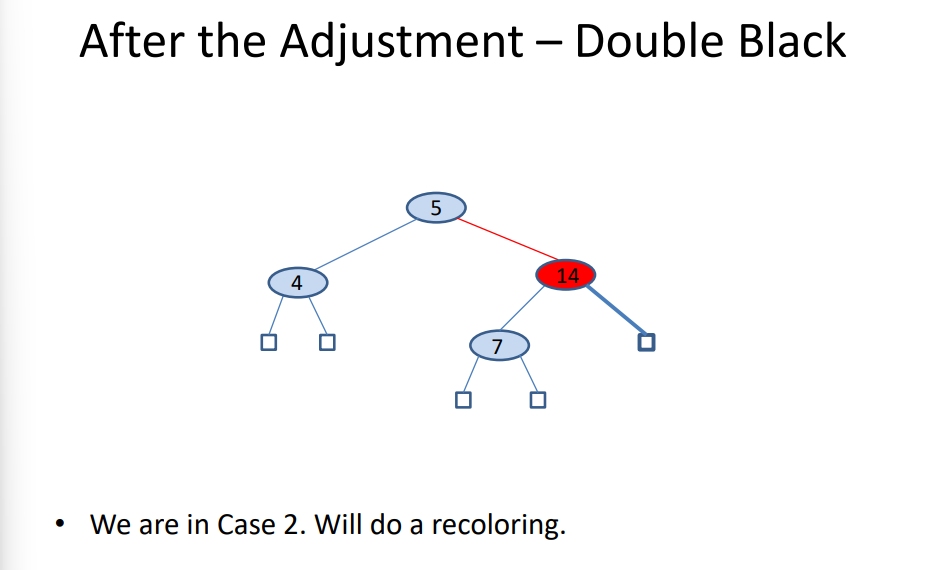

# Introduction
This file contains a "prettier" and more summarized version of the slides provided for the course "Data Structures and Programming Techniques-K08(Even)" course from the DIT at NKUA

## Contents

[🔗 Linked Data Representations](#-linked-data-representations)

[🔁 Recursion](#-recursion)

## 🔗 Linked Data Representations

### Key Concepts:
- **Linked Structures**: Lists, stacks, queues, sets, and trees are dynamic and flexible, ideal when data sizes or shapes are unpredictable.

- **Pointers in C**: Core for implementing linked structures.

    - `*` dereferences a pointer.

    - `&` gives the address.

    - `malloc()` allocates memory dynamically.

    - `free()` deallocates memory, cautioning against dangling pointers.

### Linked Lists:

- **Structure**:
    ```c
    typedef struct NodeTag {
        AirportCode Airport;
        struct NodeTag * Link;
    } NodeType;
    ```

- **Operations**:
    - Insert/delete nodes (e.g., insert in second position or at the end).

    - Traverse/search via `ListSearch`.

    - Print list using pointer traversal.

    - **Visual diagrams** help illustrate node connections and effects of operations.

### Function Examples:
- swapping with pointers:
    ```c
    void Swap(int * p, int * q) {
        int temp = *p;
        *p = *q;
        *q = temp;
    }
    ```

- insert new node:
    ```c
    N->Link = L->Link;
    L->Link = N;
    ```

- delete last node:
    Requires `NodeType ** L` to modify the head if necessary.

## 🔁 Recursion

### Introduction:

- Recursion solves problems by breaking them into smaller subproblems.

- Needs:

    - A **base case** to stop recursion.
    - Recursive step(s) to reduce problem size.

### Examples:

- **Sum of squares (m to n)**:

    - Going up: `return m*m + SumSquares(m+1, n)`;

    - Going down: `return SumSquares(m, n-1) + n*n`;

    - Divide & conquer: splits range into two halves.

- **Factorial**:
    ```c
    int Factorial(int n) {
        return (n == 1) ? 1 : n * Factorial(n - 1);
    }
    ```

- **Reversing a Linked List**:

    - **Iteratively**: uses pointers R (reversed), N (current), L1 (traverse).

    - **Recursively**: splits list into head/tail, reverses tail, then concatenates.

Advanced Example:

- **Towers of Hanoi**: classic recursion puzzle.

    - Moves are computed recursively: `2^n - 1` steps.

    - Recursive function `MoveTowers` calls itself three times.

## 🧩 Modularity and Data Abstraction

### **Principles**:

- **Procedural Abstraction**: Hide implementation details; focus on what, not how.

- **Information Hiding**: Use local variables and modular design to prevent conflicts and simplify changes.

### Modules:
- In **C**, simulated using `.h` and `.c` files:
    - `.h`: defines interface (function prototypes, types).
    - `.c`: contains private/internal details and full function implementations.

- **Encapsulation**: Bundling data and methods, common in OOP languages (e.g., Python modules, Java classes).

### Priority Queue (ADT) Example:
- Operations: initialize, check empty/full, insert, remove highest priority.

- **Implementations**:
    - **Sorted Linked List**:
        - `Insert` uses `SortedInsert` to maintain order.
        - `Remove` return and deletes head (highest priority).
    - **Unsorted Array**:
        - `Insert` appends.
        - `Remove` searches for and removes the max element.

### Complex Number ADT:
- Abstract interface hides internal structure.
- **Interface (COMPLEX.h)**:
    ```c
    typedef struct complex *Complex;
    Complex COMPLEXinit(float, float);
    float Re(Complex);
    float Im(Complex);
    Complex COMPLEXmult(Complex, Complex);
    ```
- **Implementation**:
    Uses dynamic memory, returns opaque handles.


## 📚 Stacks (LIFO - Last In, First Out)

**Real-world analogies: Plates stack, browser backtracking, function calls.**

### Stack ADT Operations:
1) `InitializeStack(S)`
2) `Empty(S)`
3) `Full(S)`
4) `Push(item, S)`
5) `Pop(S, &item)`

### Applications:
- **Balanced Parentheses Checker**:
    - Push opening brackets.
    - Pop and match for closing brackets.

- **Postfix Expression Evaluation**: 
    - Push operands.
    - On operator, pop two operands, apply operation, push result.

    ```c
    // Pseudocode
    if (token is number) push(token)
    if (token is operator) {
        right = pop(); left = pop();
        push(left op right);
    }

    ```

- **Implementations**:
    - **Array-based**:
        - Fixed size.
        - `Count` tracks top index.

    - **Linked List-based**:
        - Dynamically growing.
        - Each node points to previous.

## 🔁 Queues (FIFO - First In, First Out)
**Real-world analogies**: Printer queues, customer service lines.

### Queue ADT Operations:

1) `InitializeQueue(Q)`
2) `Empty(Q)`
3) `Full(Q)`
4) `Insert(item, Q)` – at *rear*
5) `Remove(Q, &item)` – from *front*

### Implementations:
- **Sequential (Array)**:
    - Can be inefficient due to wasted space at front.
    - Improved via **Circular Queue**:
        - Uses modulo arithmetic to wrap around.

    ```c
    Rear = (Rear + 1) % N;
    Front = (Front + 1) % N;
    ```

- **Linked List**:
    - Nodes with `Item` and `Link`.
    - Efficient, unbound size.

### Advanced Abstraction:
- Hide implementation details via `QPointer` and interface functions like `QUEUEput`, `QUEUEget`, etc.

## 🧠 Summary Table

|Concept  | Stack   | Queue |
|---------|---------|-------|
|Policy | LIFO | FIFO |
|Use Cases|	Parsing, recursion, undo | Job scheduling, simulations |
|Key Ops | Push, Pop | Insert, Remove |
|Implementations | Array, Linked List | Circular Array, Linked List|

## 🔍 Introduction to the Analysis of Algorithms
**Goal**: Understand how to evaluate algorithm performance independently of hardware or language differences.

### Key Concepts:
- **Why Analyze?**
    - Same algorithm can perform differently on different systems.
    - Focus instead on *growth* of resource usage (time, space) as input size increases.

- **Big-O Notation** (`O-notation`):
    - Measures worst-case time complexity.
    - Only the **dominant term** matters; constants are ignored.
    - Examples:
        - $O(1)$ – Constant

        - $O(logn)$ – Logarithmic

        - $O(n)$ – Linear

        - $O(nlogn)$ – Log-linear

        - $O(n^2)$ – Quadratic

        - $O(2^n)$ – Exponential

- **Example: Selection Sort**
    - Time Complexity: $O(n^2)$
    - Real-world performance varies by hardware, but the *shape* of the curve stays quadratic.

- **Case Types**:
    - *Best Case*: Minimum time
    - *Worst Case*: Maximum time (usually analyzed)
    - *Average Case*: Expected time under uniform distribution

- **Formal Definition**:
    - $f(n) = O(g(n))$ if $\exists$ constants $K$ and $n_0$ such that $f(n) \leq Kg(n)$ $\forall$ $n \geq n_0$

    - Example:
        
        - $f(n) = logn$ (red)
        - $g(n) = 2^{n}\ -\ 6$ (blue)

        

        When $n \rightarrow \infty$, $g(n)$ will always be greater than $f(n) = 2^{x}\ -\ 6$

## 🔗 Linked Lists (Revisited)

### **Representations of Lists**

- **Sequential (Array-based):**
    - Fast $O(1)$ access.
    - Costly $O(n)$ insertions/deletions; fixed size risks overflow or waste.

- **Linked (Pointer-based):**
    - Uses nodes linked by pointers.
    - More flexible for insertions/deletions, but $O(n)$ access time.

### **One-Way Linked Lists**
- Nodes point only forward
- Example data types
    ```c
    typedef struct NodeTag {
        AirportCode Airport;
        struct NodeTag * Link;
    } NodeType;
    typedef NodeType * NodePointer;
    ```
### Accessing the ith Item
- Traverse nodes using `Link` until reaching the ith item.

- Worst-case time: $O(n)$; average also $O(n)$.

### Complexity Comparison Table

| Operation                 | Array | Linked List |
| ------------------------- | ----- | ----------- |
| Length                    | O(1)  | O(n)        |
| Insert at start           | O(n)  | O(1)        |
| Delete last               | O(1)  | O(n)        |
| Replace ith item          | O(1)  | O(n)        |
| Insert/Delete at ith item | O(n)  | O(n)        |

### Variants of Linked Lists

- **Circular Linked Lists**: Last node links to the first; no distinct head/tail.

- **Two-Way (Doubly) Linked Lists**: Nodes link both forward and backward.

- **With Header/Rear Node**s: Special nodes store metadata (e.g., length) or provide list endpoints. 

### Generalized Lists

- Lists that can include sublists (recursive structure).

- Nodes can store either an item or a pointer to another list (union in C).

    ```c
    typedef struct GenListTag {
    GenListTag *Link;
        int Atom;
        union {
            ItemType Item;
            struct GenListTag *Sublist;
        } SubNode;
    } GenListNode;
    ```

- **Printing generalized lists**: Recursively print items or nested lists.

### Applications
- Generalized lists appear in AI languages like **LISP**, **Prolog**, and in **Python**.
- Useful in symbolic computation and tree-like data modeling.

## 🌳 **Trees**
### Overview
-  Hierarchical structure with (usually) a **root node** and **child nodes**
-  Common uses: 
	-  **file systems**
	-  **search trees**
	-  **parse trees**
	-  **decision trees**
	-  **game trees**
	-  **heaps**

### Terminology
-  **Root** : top node with no parent
-  **Leaf** : node with no children
-  **Internal node** : has at least one child
-  **Depth/Level** : distance from root
-  **Height** : maximum depth in a tree
-  **Subtree** : tree formed from a node and its descendants
-  **Ordered Tree** : children are arranged left to right in some specific order 

## 🌳 Binary Tree
-  Each node has at most two children
-  It can be:
	-  **Complete** : all levels are full *except possibly* the last
	-  **Proper** (Full) : **every** node has **0 or 2** nodes
	-  **Extended** : represents missing children with NULLs

-  Example :
	```
	        R
	       / \
	      S   T
	     /     \
	    Y       X

	```

### Properties of a Binary Tree
	Let:
	-  $n$ = total nodes
	-  $n_I$ = internal nodes
	-  $n_E$ = external (leaf) nodes
	-  $h$ = height
	
	Key properties:
	-  $n_E = n_I + 1$
	- $1 \leq n_E \leq 2^{h}$
	- $h \leq n_I \leq 2^{h} -\ 1$
	- $log{(n+1)} - 1$ 

### Sequential Representation

For **complete binary trees**, a tree can be represented using an array, sequentionaly, by using this indexing:

- Left child of A[i] = A[2*i]
- Right child of A[i] = A[2*i + 1]
- Parent of A[i] = A[i/2]

## 🌳 Heaps

A **complete** binary tree where each parent $\geq$ children (**max-heap**) or parent $\leq$ children (**min-heap**)

### **Complexities**

|Operation | Complexity|
|----------|-----------|
| insertion | $O(logn)$ |
| removal max/min | $O(logn)$ |
| heapify | $O(n)$ |
| heapsort | $O(nlogn)$ |

## 🔄 Tree Traversals

- **Preorder**: root $\rightarrow$ left $\rightarrow$ right
- **Inorder**: left $\rightarrow$ root $\rightarrow$ right
- **Postorder**: left $\rightarrow$ right $\rightarrow$ root
- **Level-Order**: top-down (DFS) , left-to-right (BFS) (uses a queue)

## 🧑‍💻 Binary Tree ADT (in C)

### Key types:
```c
typedef struct NodeTag {
    char Symbol;
    struct NodeTag * LLink, * RLink;
} TreeNode;
```

### Traversals:
```c
typedef enum {PreOrder, InOrder, PostOrder} OrderOfTraversal;

void Traverse(TreeNode * T, OrderOfTraversal order) {
    if (T != NULL) { 
        if (order == PreOrder) {
            /* Process this node */
            Traverse(T->LLink, order);
            Traverse(T->RLink, order);
        } else if (order == InOrder) {
            Traverse(T->LLink, order);
            /* Process this node */
            Traverse(T->RLink, order);
        } else {
            Traverse(T->LLink, order);
            Traverse(T->RLink, order);
            /* Process this node */
        }
    }
}
```

## 🌳 Binary Search Trees (BST)

A **BST** is a binary tree where: left subtree $\leq$ node $\geq$ right subtree. Used for **symbol tables**, **maps** and **dictionaries**.

### Basic Operations and Complexities

|Operation |Complexity |
|----------|-----------|
|Search |$O(logn)$ in balanced trees |
|Insert | $O(logn)$ in balanced trees |
|Deletion | $O(logn)$ in balanced trees |

### BST Example
```
        10
       /  \
      5    14
       \   / \
        7 12 18

```

### BST Node Structure in C
```c
typedef struct STnode * link;
struct STnode { 
    Item item; 
    link l, r; 
    int N; 
};
```

### Traversal
- **Inorder traversal** gives keys in sorted (ascending) order.
```c
void sortR(link h, void (*visit)(Item)) {
    if (h == z) return;
    sortR(h->l, visit);
    visit(h->item);
    sortR(h->r, visit);
}
```

### Rotations

Used to rebalance BSTs:
- **Right rotation** at `S`: promotes `S->left`
- **Left rotation**: mirror of right rotation (`S = S->right`)
- **code**:
    ```c
    link rotR(link h) {
        link x = h->l;
        h->l = x->r;
        x->r = h;
        return x;
    }

    link rotL(link h) {
        link x = h->r;
        h->r = x->l;
        x->l = h;
        return x;
    }
    ```
- **example**

    

    

    

    

    
### Root Insertion (Using Rotations)

Inserts a new node and rotates it to the root:
```c
link insertT(link h, Item item) {
    if (h == z) return NEW(item, z, z, 1);

    if (v < key(h->item)) { 
        // go deeper to insert
        h->l = insertT(h->l, item); 
        // make necessary rotations
        h = rotR(h); 
    } else { 
        // similar to the other case, but mirrored
        h->r = insertT(h->r, item); 
        h = rotL(h); 
    }
    return h;
}
```

### Select the k-th Smallest Key

Uses subtree size counts:
```c
Item selectR(link h, int k) {
    int t = (h->l == z) ? 0 : h->l->N;
    if (t > k) return selectR(h->l, k);
    if (t < k) return selectR(h->r, k - t - 1);
    return h->item;
}
```

### Deletion

3 cases: 
1) Node is leaf $\rightarrow$ remove

    

    
2) Node has one child $\rightarrow$ bypass

    

    
3) Node has two children $\rightarrow$ replace with inorder succesor and delete it

    

    

Alternatively

    

    

### Join and Partition
- **Join**: merge two BSTs
- **Partition**: place k-th smallest item at root using rotations

### BST Performance

|Case | Height $h$ | Search/Insert/Delete |
|-----|------------|----------------------|
| Best (balanced) | $O(logn)$ | $O(logn)$ |
| Worst (chain) | $O(n)$ | $O(n)$ |
| Average | $O(logn)$ | $O(logn)$ |

## 🌳 AVL Trees
### **What is an AVL Tree?**
- **AVL Tree** is a type of self-balancing binary search tree.
- Named after inventors Adelson-Velsky and Landis.
- For every node, the heights of the left and right subtrees differ by at most 1.

- **Balance Factor**
    - Balance Factor = Height(left subtree) - Height(right subtree)
    - Must be -1, 0, or +1 for all nodes.

- **Properties**:
    - The height of an AVL tree storing $n$ keys is $O(logn)$, meaning that the tree keeps its height small

### Examples:


- **Notations**

    |Notation | Meaning |
    |---------|---------|
    |/ | left-higher node |
    |\ | right-higher node |
    |\- | equal balance factor |
    |// | isn't AVL and the left path is longer |
    |\\\ | isn't AVL and the right path is longer |

- Examples: 


### **Insertion**
- If a node N is “-” and we insert a new node in its left or right subtree then the AVL tree property at node N is not lost and N becomes “/” or “\” respectively.
- If a node Ν is “/” and we insert a node in its right subtree (i.e., its shorter subtree) then the AVL tree property at node N is not lost and N becomes “-”.
-  If a node Ν is “\” and we insert a node in its left subtree (i.e., its shorter subtree) then the AVL tree property at node N is not lost and N becomes “-”.

These isertions preserve the AVL tree property and doesn't require any rotations to rebalnce it.

To maintain balance after insertions, AVL trees use rotations:
1) **Right Rotation (LL Rotation)**

    
2) **Left Rotation (RR Rotation)**

    
3) **Left-Right Rotation (LR Rotation)**
    
    
4) **Right-Left Rotation (RL Rotation)**

    

### **Deletion**:
Uses similar logic to insertion.

1) Suppose node *x* has two children. We can find the **immediate predecessor** *y* of *x* **under the inorder traversal** : take the left child of *x* and then move right as far as possible. *y* **won't have any right children**.

2) **We place *y* into the position in the tree occupied by *x***. Then, we delete *y* from its former position by proceeding as  follows.
    - Delete node *y* from the tree.
    - Since we know that *y* has at most one child, **we delete *y* by simply linking the parent of *y* to the single child of *y* (or to NULL, if there is no child)**.
    - The height of the subtree formerly rooted at *y* has been reduced by 1, so **we must trace the effects of this change on height through all the nodes on the path from the parent of *y* back to the root of the tree**.

- Example:


- Tracing the effects of the Deletions
    - trace the effects of the change on height from the parent of *y* to the root of the tree
    - we can use a **Boolean variable `shorter` to show if the height of a subtree has been shortened**.
    - the Boolean variable `shorter` is initially `TRUE`.
    - **for each node *p* on the path from the parent of *y* to the root of the tree**, if `shorter` remains `TRUE`, while, the algorithm terminates if `shorter` becomes `FALSE`.
        - **Case 1: No Rotation**

            The current node *p* has balance factor equal. The **balance factor changes** depending on **which subtree has been shortened** and `shorter` becomes `FALSE`.

            

        - **Case 2: No rotation**

            The balance factor of *p* is not equal, and the taller subtree was shortened. We will change the balance factor of *p* to equal and leave `shorter` as `TRUE` because the height of tree rooted at *p* has changed.

            

        - **Case 3**

            The balance factor of *p* is not equal and the shorter subtree was shortened. **The height requirement for an AVL tree is now violated at p**, so we apply a rotation as follows to restore balance.

             Let *q* be the root of the taller subtree of *p* (the one not shortened). We **have three cases according to the balance factor of *q***.

            - **Case 3a: Single left rotation**

                **The balance factor of *q* is equal**. A single left rotation at *p* (with changes to the balance factors of *p* and *q*) restores balance, and `shorter` becomes `FALSE`.

                

            - **Case3b: Single left rotation**

                **The balance factor of *q* is the same as that of *p*.** We will apply a single left rotation at *p*, set the balance factor of *p* and *q* to equal, and leave `shorter` as `TRUE`

                

            - **Case 3c: Double right-left rotation**

                **The balance factors of *p* and *q* are opposite.** We will apply a double right-left rotation at *q* and *p*, set the balance factor of the new root to equal and the other balance factors as appropriate, and leave `shorter` as `TRUE`. 

                

            - **Symmetric Cases**

                In the cases above, we only shoes only one cases of the "not equal" balance factor of node *p* ("\"). The other case ("/") is symmetric.

- Applying the Deletion Algorithm to the previous **example**

    

    

    

    

1) trace the effects of this change on height through all the nodes on the path form *n* (parent of *o*) to the root of the tree.
2) we will use the bool variable `shorter` to show if th eheight of a subtree has been shortened. The boolean variable `shorter` is initially `TRUE`.
3) the balance factor of the node *n* is not equal (it is "\") and the taller subtree was shortened.* We have Case 2 of the algorithm where no rotation is required.* We will change the balance factor of *n* to equal and leave `shorter` as `TRUE` because the height of tree rooted at *n* has changed. 

    

4) we move to node *o* and examine its balance factor: "\\\\" and the shorter subtree was shortened. We will apply rotation to restore balance.
5) the root of the taller subtree of *o* (the one not shortened) is *s* and with balance factor of "\\" (same as *o*). Therefore, we have case **3b of the algorithm**.  We will apply a single left rotation at *o*, set the balance factors of *o* and *s* to equal, and leave `shorter` as `TRUE`.

    

    

6) at node *m* the balance factor is "//" and the shorter subtree was shortened. We will apply rotation to restore the balance.
7) the root of the taller subtree is *e* with balance factor "\" (opposite to m). That is case 3c of the algorithm.
8) we will apply a **double left-right rotation** at *e* and *m*, set the balance factors of the new root *j* to equal and the balance factors of *e* and *m* as appropriate, and leave `shorter` as `TRUE`.

Since we have reached the root of the tree, the algorithm terminates.


The algorithm can be implemented both iteratively and recursively

### **Searching**
Since an AVL tree is a binary search tree, the search algorithm remains the same.

### **Complexities**

|Operation | Complexity|
|----------|-----------|
| search | $O(logn)$ |
| insertion | $O(logn)$ |
| deletion | $O(logn)$ |

## 🌳 Multi-Way Search Trees
- each internal node stores more than one key
- search trees
- ordered (linear ordering defined for the children of each node) - can identify children being first, second,..., last.
- let $v$ be a node in an ordered tree. we say that $v$ is a *d-node* if $v$ has $d$ children.

### Properties

a **multi-way search tree** is an ordered tree *T* that has the following properties:

- internal nodes have at **least 2 children** (all *$d$-nodes* with $d$ $\geq$ 2)
- each *$d$-node* of T with children $v_1$,...,$v_d$, stores and ordered set of $d-1$ key-values: $k_1\ \lt\ ...\ \lt\ k_{d-1}$
- we can say that $v_1\ \lt\ k_1\ \lt\ ...\ \lt\ k_{d-1}\ \lt\ v_d$, which makes searching an easy process
- external nodes don't store any values or have any children (**dummy nodes**)
- no duplicates are allowed, so multi-way search tree can be used to implement **maps**.


### Complexities
|Operation | Complexity |
|----------|------------|
|Search | $O(hlogm)$ |
|Insertion/ Deletion| $O(logn)$ avg time|

where: 
- $h$ = tree height
- $m$ = number of maximum children allowed
- $n$ = number of nodes in the tree

### Balanced Multi-way Search Trees
- **(2, 4) Trees** 
- **Red-Black Trees**
- **(a, b) Trees**
- **B-Trees**

## 🌳 (2, 4) Trees (or 2-3-4 Trees)
Multiway Search Trees with the following properties:
- **Size property**: internal nodes have $k$ amount of keys, where $1\ \leq\ k\ \leq\ 3$ and $v$ children, where $2\ \leq\ v\ \leq\ 4$

- **Depth property**: all external nodes are empty tree that have the same depth


### Search
Same algorithm for searching any multi-way tree

### Insertion
Suppose we want to insert a key $k$

1) perform search for $k$
2) if $k$ hasn't already been inserted, the search terminates at an external node $z$, where $v$ is $z$'s parent.
3) we insert $k$ at $v$ and add a new external node (NULL) on the left of $z$.

The insertion preserves the **depth property** but might violate the **size property**. If a $v$ node was a 4-node, it might now become a 5-node after insertion. This type of size violation is called **overflow** at node $v$.

- **Dealing with overflows**

    Let $c_1$, ... ,$c_5$ be the children of node $v$ and $k_1$, ... ,$k_4$ the values stored at $v$. we must perform a **split** operation on $v$ to remedy the overflow:

    1) Replace $v$ with two nodes: 
        - $v'$, a three node with children $c_1, c_2, c_3$ and storing keys $k_1$ and $k_2$
        - $v''$, a two node with children $c_4, c_5$ and storing key $k_4$
    2) If $v$ was the root of the tree, create a new root $u$. Let $u$ be the parent of $v$ ($v'$ and $v''$). Insert key $k_3$ int $u$ and make $v'$ and $v''$ the children of $u$.

        If $v$ was child $i$ of $u$ then $v'$ and $v''$ become children $i$ and $i+1$ of $u$ respectively.


    **Overflow example**:

    

    

    

    **Insertion examples**:

    

    

    

    

    

    

    

    

    

    

    

    

    **More complicated example of insertion**:

    

    

    

    

    

    

    

### Deletion
Suppose we want to delete a key $k$

1) Search for $k$ in the tree
2) If we find $k$ as the $i$-th entry in a node $v$ and it only has external children ($v$ is a leaf node), we just remove it $k$ and the $i$-th external node of $v$

Removing an entry from a node $v$ **preserves the depth property**, but **can violate the size property**. If $v$ was a 2-node before deleting $k$, then after, it becomes a 1-node and causes **underflow**.

- **Dealing with underflows at leaf nodes**
    1) check if an **immediate sibling of $v$ is a 3-node or a 4-node**. if such sibling $w$ has been found, then we perform a **transfer** operation, in which we move a child of $w$ to $v$, a key of $w$ to the parent $u$ of $v$ and $w$ and a key of the parent $u$ to $v$.

    2) if $v$ has only one sibling and it is a 2-node, or if both immediate sibling of $v$ are 2-nodes, then we perform a **fusion** operation, in which we merge $v$ with one of its siblings, creating a new node $v'$ and move a key from the parent $u$ of $v$, to $v'$.

    If an underflow propagates all the way up to the root, then the root is deleted

- If we wish to remove an entry $k$ at a node $v$ which **is not a leaf node**, we swap $k$ with an appropriate entry that is located at a leaf node. This can be done by:
    - we find the **right-most leaf node, $u$** in the subtree rooted at the $i$-th child of $v$ ($k$ is the $i$-th entry at $v$). 
    - we swap $k$ with the last entry of $u$ and now we can delete $k$ and deal with any possible underflows, based on the algorithm described above.

    This can be done because the entry we swaped with $k$ is the immediate predecessor of $k$. Example:

    

    

Here are some exampled of removal in a (2, 4) Tree:




### Complexities
|Operation | Complexity |
|----------|------------|
|Search | $O(logn)$ |
|Insertion | $O(logn)$ |
|Deletion | $O(logn)$ |

**NOTE**: the code for (2, 4) Trees implementations is in *`hws/hw2/question5`*

## 🌳 Red-Black Trees
Data structures which require **$O(1)$ structural changes** after an update in order to remain balanced. They are **binary search trees** with nodes colored **red and black** in a way that satisfies the following properties:
- **Root Property**: The **root is black**
- **External Property**: Every **external node is black**
- **Internal Property**: The **children of a red** node are **black**
- **Depth Property**: All the external nodes have the same **black depth**(= the number of black ancestors minus 1, since a node is an ancestor of itself)

Red-Black trees are used to implement maps so **no duplicates** are allowed.

Example:


### (2, 4) Trees $\rightarrow$ Red-Black Trees
We perform the following operations for each node:
- $v$ is a 2-node $\rightarrow$ keep the black children of $v$ as is
- $v$ is a 3-node $\rightarrow$ 
    1) create a new red node $w$
    2) give $w$ the first two (black) children of $v$
    3) make $w$ and $v$'s third child be the two children of v (*symmetric operation is also possible*)
- $v$ is a 4-node $\rightarrow$
    1) create two new red node, $w$ and $z$
    2) split $v$'s four children equaly to $w$ (1st and 2nd) and $z$ (3rd and 4th)
    3) make $w$ and $z$ be the two children of $v$


### Red-Black Trees $\rightarrow$ (2, 4) Trees 
- merge every **Red node** $v$ with its parent and storing the entry from $v$ at is parent.
- the two children of $v$ become the first and last child of $v$, respectively, and $v$ becomes a 3-node or 4-node.


The height of a Red-Black Tree storing $n$ entries is $O(logn)$

### Searching
Red-Black Trees are binary search trees, so the searching is done using the same algorithm.

### Updates (Insertion/Deletion)
Updates for a red-black tree are done in the same way the are for a BST, but the **color properties must be preserved**.

It is important to keep in mind the **correspondance** with a (2, 4) Tree and the **relevant update algorithms** for (2, 4) Trees.

### Insertion
Suppose we want to insert a key $k$ into a red-black tree. Here are some examples in an initally empty tree:


- we add $k$ as a new leaf node $z$. (= addind a leaf node at a (2, 4) Tree)
    - if $z$ is the root, we color $z$ black
    - else we color $z$ red

    This preserves the root, external and depth properties of the tree, but it **might violate the internal property**.

- in case we have a parent $v$ and child $z$ node be both red
    - $v$ cannot be the root
    - the parent $u$ of $v$ must be black
    - since $z$ is red, $u$ is also red and $v$ is black, we call this violation of the internal property a **double red** at **$z$**

- to remedy a **double red** we consider two cases

1) **the sibling $w$ of $v$ is black**
    - we have created a malformed replacement for a corresponding 4-node of the (2, 4) Tree
    - our malformed replacement has one node $v$ that is the parent of another red node $z$ while **we want to have two red nodes as sibling instead**.
    - to fix this, we perform a **trinode restructuring**
        Suppose (in order):
        - $z$ = $a$
        - $v$ = $b$ 
        - $u$ = $c$

        1) replace $u$ with $b$
        2) make $a$ and $c$ children of $b$ (still in order)
        3) we color $b$ black and $a$ and $c$ red

    The restructuring **eliminates** the double red problem

    

    

    

    

2) the sibling $w$ of $v$ is red
    - in this case, the **double red** denotes an overflow in the corresponding (2, 4) Tree
    - we perform the **equivalent of a split operation** = **recoloring**:

        we color $v$ and $w$ black and their parent $u$ red, unless it's the root, then it is colored black

    

    

#### Recoloring vs. Trinode Restructuring

| | Recoloring | Trinode Restructuring |
|---|------------|------------------------|
|color change| ✅ | ✅ |
|structure change| ❌ | ✅ |

**NOTE**: ***recoloring*** should not be used in the case of trinode restructuring, even if the colors do change

It is possible that after the recoloring the **double red** problem reappears at a parent node. Then, we repeat the algorithm desribed above, until the **double red** problem is finally resolved.

More insertion examples:





**The insertion of a key-value entry in a redblack tree storing $n$ entries can be done in $O(logn)$ time and requires $O(logn)$ recolorings and one trinode restructuring.**

### Removal

Suppose we want to remove key $k$ from a red-black tree. First, here are some examples:


- Removing a red node from a red-black tree doesn't violate any red-black tree properties. 
- **Careful** in case this node is not a leaf, hence we need to remove the successor or predecessor of this node, and this node might be **black**

- Here is the algorithm for removing an entry $k$ from a red-black tree
    1) we find the node $u$ that stores the wanted entry
    2) if $u$ is not a leaf node, we find the successor or predecessor of $k$ which is in a node $v$. 
    3) we exchange the values $u$ and $v$ store and perform the removal at $v$
    4) to remove the entry $k$ from a node $v$ with external-node child $w$ (=`NULL`) we proceed as follows:
        - let $r$ be the sibling of $w$ and $x$ the parent of $v$. We remove nodes $v$ and $w$ and make $r$ a child of $x$
        - if $v$ was red (so $r$ is black) then none of the properties of the re-black tress is violated and we are done.
        - if $r$ is red (so $v$ is black), then **the depth property is violated**. We color $r$ black to restore the depth property.

        

        In general, $r$ might have children that are not external nodes. The previous discussion is valid for this case as well.

    5) if $r$ is black and $v$ is black, the depth property is again violated (at $r$). we give $r$ a fictious **double black** color. we now have a color violation, called the **double black problem**

        

        

        **Double Black** is basically an underflow in the corresponding (2, 4) Tree. We have three cases of **double black**, depending on the color of sibling $y$ of $r$ in the tree resulting from the deletion of $v$ and the color of $y$'s children.

        1) the sibling $y$ of $r$ is black and has red child $z$ (equivilant to a transfer operation in a (2, 4) Tree)

            - we perform **trinode restructuring**: 
                - $z$ = $a$
                - $y$ = $b$
                - $x$ = $c$

                we replace $x$ with $b$ making it parent of other two nodes. we color $a$ and $c$ black, give $b$ the former color of $x$ and color $r$ black

                

                

                

                

                

                

                

        2) the sibling $y$ of $r$ is black and both children of $y$ are black (equivilant to a fusion operation in a (2, 4) Tree)

            - we do a **recoloring**:
                - $r\ \rightarrow$ black 
                - $y\ \rightarrow$ red 
                - if $x$ is red $\rightarrow$ color it black
                - otherwise, $\rightarrow$ color it **double black**

                Hence, after this recoloring, the double black problem might reappear at the parent 𝒙 of 𝒓. We then repeat consideration of these three cases at 𝑥.

                

                

                

                

                

                

                
        
        3) the sibling 𝒚 of 𝒓 is red. we perform an **adjustment operation as follows**
            - If 𝑦 is the right child of 𝑥, let 𝑧 be the right child of 𝑦; otherwise, let 𝑧 be the left child of 𝑦.
            - Execute the trinode restructuring operation which makes 𝑦 the parent of 𝑥.
            - Color 𝑦 black and 𝑥 red.

            An adjustment corresponds to choosing in the red-black Tree a different representation of a 3-node from the corresponding (2,4) Tree.

            After the adjustment operation, the sibling of 𝑟 is black, and either **Case 1** or **Case 2** applies, with a different meaning of 𝑥 and 𝑦.

            - Note that if **Case 2** applies, the double black problem cannot reappear because the parent of 𝒓 is red.

            - Thus, to complete **Case 3** we make one more application of either **Case 1** or **Case 2** and we are done. 

            - Therefore, **at most one adjustment is performed** in a removal operation.

            

            

            

            

            

            

The algorithm for removing an entry from a red-black tree with 𝑛 entries takes 𝑶(𝐥𝐨𝐠𝒏) time and performs 𝑶(𝐥𝐨𝐠𝒏) recolorings and at most one adjustment plus one additional trinode restructuring

Bigger example of removal:


### Summary

- red-black tree data structure is **slightly more complicated** than its corresponding (2,4) tree.
- however, the red-black tree has the conceptual advantage that **only a constant number of trinode restructurings are ever needed** to restore the balance after an update.

## 🌳 B-Trees
### 📦 What Are B-Trees?
- B-Trees are multi-way balanced search trees designed for efficient access on external memory (e.g., hard disks).
- They generalize binary search trees by allowing nodes to have more than two children and by minimizing disk I/O.

### 📁 Why B-Trees?
- Disk access is ~100,000–1,000,000x slower than RAM access.
- B-Trees reduce the number of costly disk reads during search, insert, and delete operations.

## 🌲 (a, b)-Trees
- General form of B-Trees.
- Must satisfy:
    - **Size property**: internal nodes (except root) have at least a and at most b children.
    - **Depth property**: all external (leaf) nodes are at the same depth.

- Height of (a, b)-Trees
    - Bounded by:
        $\frac{log_a(n+1)}{2}\ \gt\ h\ \gt\ log_b(n+1)$

        Hence, the tree height is logarithmic in $n$.

### 🌳 B-Trees (Special Case)
- A B-tree of order m is a (⌈m/2⌉, m) tree.
- Nodes store up to m−1 keys and m pointers.
- Chosen so a node fits in one disk block.

### 🔍 B-Tree Operations

- Search:

    - Similar to **binary search** across keys in node.
    - Takes $O(log_dn)$ where $d$ = ⌈m/2⌉.

- Insertion:

    1) Search for location.
    2) If node is full → split at median.
    3) Push median key to parent.
    4) May cause splits up to root.

- Deletion:

    1) Replace internal keys with predecessor/successor.
    2) If underflow occurs:
        - Transfer from sibling if possible.
        - Else, fuse with sibling and push key from parent down.

    3) May propagate up to the root.

Both **Insertion** and **Deletion** are similar to the ones done at (2, 4) Trees

### Complexities
|Operations | Complexities|
|--------|-----------|
|Disk access per operation | $O(1)$ |
| split/transfer/fusion | $O(1)$ disk I/O |

### 🪴 B+-Trees (Extension of B-Trees)
- Internal nodes store only keys (indexes)
- Leaf nodes store full key-value entries and are linked
- Excellent for range queries and database indexing

### 📌 Summary Table

| Feature        | B-Tree          | B+-Tree                 |
| -------------- | --------------- | ----------------------- |
| Internal nodes | Keys + values   | Only keys               |
| Leaves         | Keys + values   | Keys + values, linked   |
| Search         | All levels      | Bottom layer only       |
| Best for       | Balanced search | Indexing, range queries |


## ⏭️ Skip List
- A skip list is a probabilistic data structure that allows fast search, insertion, and deletion, similar to balanced trees.
- Think of it as a tower of linked lists, where each node can have multiple "forward pointers" allowing it to skip over others.

### 📈 Key Idea
- Multiple levels of forward links are added to speed up traversal:
    - Level 0: normal linked list
    - Level 1: skips 2 nodes
    - Level 2: skips 4 nodes

- Search and update operations move horizontally across higher levels, and drop down as needed.

### 🧱 Structure & Definitions
- Each node stores:
    - `item` (value/key)
    - `next[]`: array of forward pointers
    - `sz`: number of levels (i.e., length of `next[]`)

- code:
    ```c
    typedef struct STnode * link;
        struct STnode {
        Item item;
        link * next;
        int sz;
    };
    ```

### 🔧 Initialization
- `STinit(int max)`: initializes the skip list with a header node and a sentinel node `z` (acts as the NULL terminator).
- `NEW(item, k)`: creates a node with k forward pointers initialized to `z`.

### 📦 Search Operation
Recursive search strategy:
```c
Item searchR(link t, Key v, int k) {
    if (eq(v, key(t->item))) return t->item;
    if (less(v, key(t->next[k]->item))) {
        return (k == 0) ? NULLitem : searchR(t, v, k - 1);
    }
    return searchR(t->next[k], v, k);
}
```
- Searches start from the topmost level and proceed down.

### 🛠 Insertion Strategy
- Assign a random height to the new node using `randX()`, which returns `i` with probability $\frac{1}{2^i}$
- Traverse from the top level down and insert the node at every level ≤ i.

- Insertion function:
    ```c
    void insertR(link t, link x, int k) {
        if (less(key(x->item), key(t->next[k]->item))) {
            if (k < x->sz) {
                x->next[k] = t->next[k];
                t->next[k] = x;
            }
            if (k == 0) return;
            insertR(t, x, k - 1); return;
        }
        insertR(t->next[k], x, k);
    }
    ```

### ⚙️ randX – Random Level Generator
- Based on a geometric distribution:
    ```c
    int randX() {
        int i, j, t = rand();
        for (i = 1, j = 2; i < lgNmax; i++, j *= 2)
            if (t > RAND_MAX / j) break;

        if (i > lgN) lgN = i;
        return i;
    }
    ```
- Ensures a small number of tall nodes (like express lanes).

### 📉 Deletion
- Recursively search and unlink the node at each level.
- Free the node memory only once, after unlinking from the lowest level.
- Deletion function:
    ```c
    int deleteR(link t, Key v, int k) {
        link x = t->next[k];
        if (!less(key(x->item), v)) {
            if (eq(v, key(x->item))) {
                t->next[k] = x->next[k];
                if (k == 0) { 
                    free(x->next); free(x); 
                    return 1; 
                }
            }
            return deleteR(t, v, k - 1);
        }
        return deleteR(t->next[k], v, k);
    }
    ```

### 📊 Complexity (with t = 2)

- Search & Insertion: O(log N) expected comparisons
- Total forward pointers: ≈ (t / (t - 1)) × N

### 🧠 Skip List vs (2,4)-Tree
Skip list is functionally equivalent to a balanced tree.


## 📌 Hashing
- Hashing is a method to implement symbol tables by converting keys into addresses via a hash function, allowing near-constant-time operations.
- Unlike search-based methods (e.g., binary search trees), hashing attempts **direct access** to data.

### 📂 Symbol Table ADT
- Abstract structure: stores unique (`Key`, `Info`) pairs.
- Key operations: initialize, insert, delete, search, update, enumerate.

### 🧱 Symbol Table Implementations
- Previous methods: sorted arrays, linked lists, binary/AVL/red-black/(2,4) trees, skip lists.
- New method: Hashing — fast access via direct mapping of keys to table indices.

### 🔑 Hashing Example
- Keys: letters with numeric subscripts (e.g., A₁, C₃, R₁₈).
- Table size: 7; Hash function: `h(K) = K % 7`.

### ⚠️ Collisions
- **Collision**: Two keys hash to the same address.
- **Resolution Techniques**:
    - **Open Addressing**: linear probing or double hashing.
        - **Linear Probing**: sequential search for next available slot.
        - **Primary Clustering**: adjacent occupied cells lead to longer searches.
        - **Double Hashing**: uses a second hash function to calculate probe steps → reduces clustering.
    - **Separate Chaining**: linked list per bucket; space-consuming but fast.

### 🧠 Good Hash Functions
- Should distribute keys uniformly and randomly.
- Collisions are inevitable; minimize their frequency.
- Load Factor: $α\ =\ \frac{N}{M}$ ($\frac{\text{number of entries}}{\text{table size}}$) — key performance driver.

### 📈 Performance
- Performance depends mainly on load factor α.
    - **Complexity**:
        - Successful Search: $O(1)$
        - Insertion: $O(1)$
        - Deletion: $O(1)$ (with special marking)
        - Enumeration: $O(nlogn)$

    - **Knuth's and Guibas-Szeredi's formulas quantify search costs for each method**.

### 📊 Average Probes at Different Load Factors:
| α    | Separate Chaining (Success) | Open Addressing (Linear) | Open Addressing (Double) |
| ---- | --------------------------- | ------------------------ | ------------------------ |
| 0.5  | 1.25                        | 1.5                      | 1.39                     |
| 0.9  | 1.45                        | 5.5                      | 2.56                     |
| 0.99 | 1.49                        | 50.5                     | 4.65                     |

### 🔁 Rehashing
- When α exceeds threshold, rehashing (resizing) is needed.
    - Suggested thresholds: α < 0.5 for open addressing, α < 0.9 for chaining.
    - Rehash to a table **at least twice the size**.

### ⚙️ Hash Function Design
- Steps:
    1) **Hash Code**: map key → integer.
    2) **Compression**: map integer to [0, M-1].

**Techniques**:
- **Division Method**: `h(K) = K % M`, M should be a prime.
- **Polynomial Hashing**: e.g., Horner’s method.
- **Cyclic Shift**: good for strings.
- **MAD Method**: `h(i) = (a*i + b mod p) % M`, where `p > M`.

### 🔬 Experimental Insight
Hash codes like cyclic shift with **5-bit rotation** minimize collisions in large datasets.

### 📚 Applications
Widely used in:
- Symbol tables (e.g., compilers)
- Databases
- Cryptography
- Browser caches
- Peer-to-peer systems

## 📘 Graphs — Summary
### 🔹 What is a Graph?
- A graph $G\ =\ (V,E)$ is a set of **vertices** (nodes) and **edges** (connections).
- Edges can be:
    - **Undirected**: No direction (e.g., friendships).
    - **Directed** (digraphs): Have direction (e.g., one-way roads).

### 🔹 Key Concepts
- **Adjacency**: Two vertices are adjacent if connected by an edge.
- **Incident**: An edge is incident on its connected vertices.
- **Path**: A sequence of vertices where each is adjacent to the next.
    - **Simple Path**: No repeated vertices.
- **Cycle**: A path that starts and ends at the same vertex.
    - **Simple Cycle**: No repeated vertices/edges except the start/end.
- **Reachability**: Vertex $u$ is reachable from $v$ if there’s a path 𝑣 → 𝑢
- **Connected Graph** (undirected): All vertices reachable from each other.
- **Strongly Connected** (directed): Every vertex can reach every other.

### 🔹 Graph Components
- **Connected Component**: Maximal set of connected vertices in undirected graph.
- **Strongly Connected Component**: Maximal set where each vertex is reachable from all others in directed graph.

### 🔹 Vertex Degree
- **Undirected**:
    - `deg(v)` = number of edges incident on $v$.
    - Sum of all degrees = 2 * number of edges.

- **Directed**:
    - `indeg(v)` = incoming edges.
    - `outdeg(v)` = outgoing edges.
    - Sum of indegrees = sum of outdegrees = number of edges.

### 🔹 Graph Types
- **Subgraph**: A graph formed from subsets of vertices/edges.
- **Spanning Subgraph**: Includes all vertices of original graph.
- **Forest**: No cycles.
- **Tree**: Connected forest (no cycles).
- **Spanning Tree**: Spanning subgraph that is a tree.
- **Spanning Forest**: Union of spanning trees for disconnected graphs.

### 🔹 Graph Representations
- Adjacency Matrix:
    - $n\ \times\ n$ matrix, 1 if edge exists, 0 if not
    - Space: $O(n)$
- Adjacency List:
    - Lists of neighbors for each vertex.
    - Space: $O(n+e)$, efficient for sparse graphs.

### 🔍 Graph Searching Techniques
- 🔹 DFS (Depth-First Search)
    - Uses a **stack** (or **recursion**).
    - Explores **deeply** before backtracking.
    - Analogous to **pre-order traversal**.
    - Complexity: $O(n+e)$

-🔹 BFS (Breadth-First Search)
    - Uses a **queue**.
    - Explores **level-by-level** (like level-order traversal).
    - Good for **finding shortest path** in **unweighted** graphs.

## 📗 Weighted Graphs — Summary